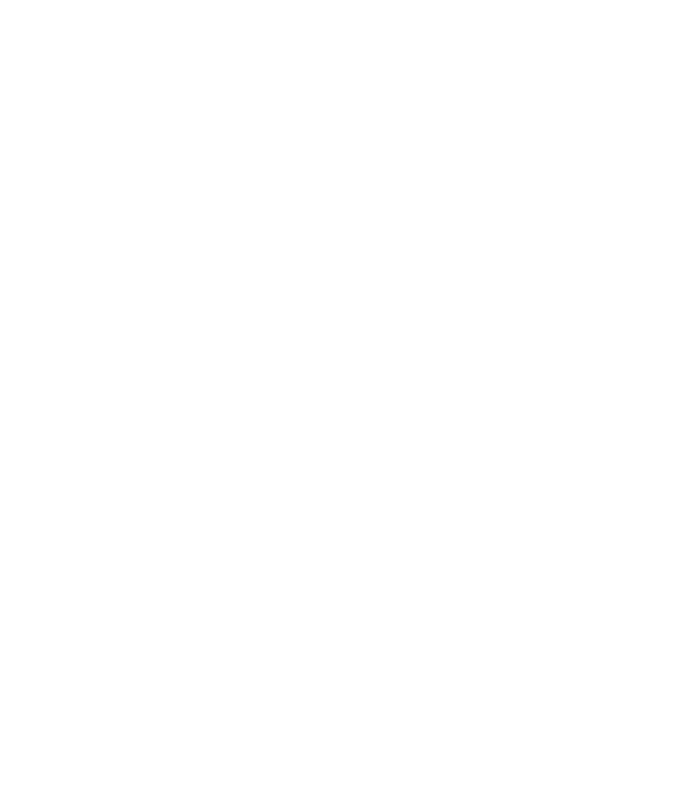

# MS3 README
# Pad Plants
## By Fay Skerritt

Pad Plants is a community web app that allows users to view a variety of house plants with specific details about how to care for them in your home. Users can register a profile on the site which will allow them to add, edit and delete plants on the web app.

Unordered List
* Item 1
* Item 2
  * Item 2a
  * Item 2b

[link to web address](http://github.com)

> a quote

**Bold Text Large** 
--------

**Bold Text Small**

*Italic Large*
--------

*Italic Small*

