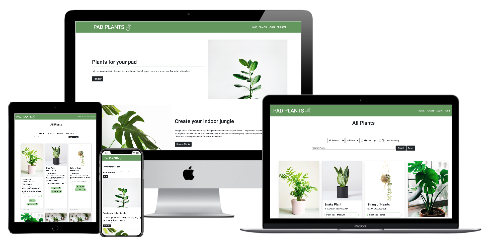
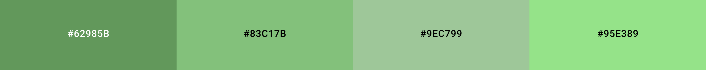

# **Pad Plants**
## Milestone Project 3: Backend Development - Code Institute
## By Fay Skerritt

Pad Plants is a community web app that allows users to view a variety of house plants with specific details about how to care for them in your home. Users can register a profile on the site which will allow them to add, edit and delete plants on the web app.

# Demo 
Live demo can be viewed [here, deployed to Heroku](https://pad-plants.herokuapp.com/)

# UX
## User Stories
### New User
* As a new user, I want to understand the main purpose of the site, so I can learn more about the site’s features.
* As a new user, I want to see tha plants featured on the website, so I can learn more about plants.
* As a new user, I want to be shown where I can buy plants, so I can purchase a house plant.

### Returning User
* As a returning user, I want to register to the site, so I have my own profile to store my information.
* As a returning user, I want to add plants to the database, so I can share my plant knowledge with the community.
* As a returning user, I want to have access to all plants added by other members, so I can benefit from other people's knowledge.
* As a returning user, I want to be able to logout of my profile, so I can keep my data safe.

### Frequent User
* As a frequent user, I want to edit my added plants, so I can keep the information current.
* As a frequent user, I want to search for specific plants, so I can find information about plants I own.
* As a frequent user, I want to be able to delete my added plants, so I can ensure no duplicates in the database.
* As a frequent user, I want to view all plants with specific filters, so I can choose a new house plant to suit my needs.

### Site Owner/Developer
* As the owner/developer, I want to expand my database of plants, so I can broaden my knowledge.
* As the owner/developer, I want to redirect users to a store, so I can gain sales from people intereted in plants.
* As the owner/developer, I want to grow my community of plant lovers, so I have an audience of potential customers.

## Design
### **Colour Scheme**
* Green was chosen as it complimented the photos of the plants nicely. Also was in keeping with the green of the leaves
* A range of greens were chosen for different attributes:
    * A darker green   `#62985b` for the Navbar and Footer with white text for easier viewing and contrast.
    * A lighter and softer green  `#83c17b` was used for the bottom border of the headings for a subtle underline.
    * Another lighter green  `#9ec799` was used for the background of the banner where flash messages are displayed so these stood out from the other elements.
    * A more prominent green  `#95e380` was used for the hover of buttons and links.

### **Typography**
* Roboto was chosen for the font to go with the linear pattern of the site. It was thought that anything too fancy wouldn't have gone well with the house plant images.

### **Imagery**
* The home page features two artistic images of houseplants, which capture the eye and go well with the green colour theme.
* The profile and 404 pages also feature artistic imagery of houseplants which are inkeeping with the theme.
* Font Awesome icons are used in areas to clearly label input fields and headers.
* Each plant has an image at the top of the card which shows the user exactly what the plant looks like.

### **Wireframes**
**Home page:**

* 2 column structure on larger screens which changes to 1 on smaller screens. Had to use a Bootstrap row-reverse class to switch the second image and text to show opposite to the top whilst still showing text - image - text - image on a mobile device.
    * Figma screenshot - [Home](https://raw.githubusercontent.com/fayskerritt/padplants/master/static/img/readme/homewireframe.png)

**Plants page:**

* Wireframe shows a hero image but during development the page looked too busy with an image so left that out.
    * Figma screenshot - [Plants](https://raw.githubusercontent.com/fayskerritt/padplants/master/static/img/readme/plantswireframe.png)

**Profile page:**

* Image added to the side of the Username as page looked quite bare for new users.
    * Figma screenshot - [Profile](https://raw.githubusercontent.com/fayskerritt/padplants/master/static/img/readme/profilewireframe.png)

**Add Plant page:**

* Page copied to create Edit page by filling in the inputs from the database
* Font Awesome icons used to represent the 3 different light conditions; Shade, Light & Shade and Direct Sunlight. Also to represent the 5 rooms; Bathroom, Bedroom, Living Room, Study and Kitchen.
    * Figma screenshot - [Add Plant](https://raw.githubusercontent.com/fayskerritt/padplants/master/static/img/readme/addwireframe.png)

**Login page:**

* Simple form, ended up adding Font Awesome icons to the Username and Password Labels
    * Figma screenshot - [Login](https://raw.githubusercontent.com/fayskerritt/padplants/master/static/img/readme/loginwireframe.png)

**Register page:**

* Same form layout as Login page with extra input to confirm password, this was to prevent an error when entering their password first time round.
    * Figma screenshot - [Register](https://raw.githubusercontent.com/fayskerritt/padplants/master/static/img/readme/registerwireframe.png)

### Creation of database on MongoDB:
* Once registered and logged in to [MongoDB](https://www.mongodb.com/) a database was created named 'pad-plants' and a document was added to the Plant collection with the following 'key: value' pairs:

    `_id:` (str)\
    `name:` (str)\
    `botanical_name:` (str)\
    `description:` (str)\
    `watering:` (str)\
    `size:` (str)\
    `light_needed:` (str)\
    `room:` (str)\
    `img_url:` (str)

* These keys were used when adding any more plants to the database.
* The other collection used was Users which had the 'key: value' pairs:

    `_id:` (str)\
    `username:` (str)\
    `password:` (str)

* The password string is hashed when the user inputs it using the Werkzeug generate_password_hash method, so is stored as a string.

# Features
### Existing Features
* Registration - Creating a profile using a unique username and password which is stored in the database, the password will be hashed for better security.
* Displaying database of plants on the Plants page - Pulling the data from MongoDB to display the list of all plants in the database with all fields displayed nicely in their own individual cards.
* Adding a plant - Creating a plant and adding it to the database using the Add Plant form. This allows the user to input the name, botanical name and a description. There are two drop downs for the user to choose the size and how often the plant needs watering. There are also two lots of radio checkboxes that the user can choose how much light the plant needs and which room the plant goes best in. Finally there is an input for the user to add a URL for an image, however if the URL doesn't work then the image displayed will be a default image.
* Editing a plant you have addded - An edit button will be available to edit the fields of a plant you have added, the previously chosen fields will be autofilled on the Edit page. The Admin user profile has access to edit all plants.
* Deleting a plant you have added - A delete button will be available to delete a plant that you have added. The Admin user profile has access to delete all plants.
* Viewing all plants you have added on your Profile page - Pulling data from MongoDB to display the plants that have been added by the user that is logged in, this uses the 'created by' field.
* Searching the database - 
    * The search has the option of a text input, which searches the plant name, botanical name and description fields. 
    * Two drop down menus that allow the user to search by room and by size. 
    * Two check boxes that allow the user to filter the list by plants that are happy in low light and plants that do not need watering very often. 
    * You can combine all these search fields to find the perfect plant for you.
* Different buttons and options visible depending on logged in status - 
    * Register and Login options in the navbar are visible before logging in, which are hidden to show the Logout option once logged in. 
    * Register button on the home page changes to Browse once logged in. 
    * Edit and Delete buttons are only visible against plants that the logged in user has created.
    * Edit and Delete buttons are visible on all plants to the Admin user.
* Visible buttons when no search results found - 
    * If no plants are found when using the search functionality then a message will show and an Add button will be visible.
    * If no plants have been added yet by the current user, a message and Add button will show on the profile page.
* Responsiveness - As can be seen in the mockup at the top of this README the site is responsive across all sizes of device. The Bootstrap Grid framework was used to enable this.
* Defensive Programming - A modal is used to ask the user if they are sure they want to delete a plant when the Delete button is clicked.
* Interactive Navbar that displays a bottom border when hovering as well as bolder font on the page that is active.
* An external link is present on the home page with the option to buy plants, this sends users to an Amazon page currently.
* Social Media links in the footer - Links to social media pages increase engagement with users.

### Features to Implement in the Future
* Pagination on the Plants page as the database grows.
* A link to an active selling page to be added to the home page to gain sales from community members.
* A link option on each plant card to send the user to a site where the plant is available to buy.

# Technologies Used

* [HTML5](https://en.wikipedia.org/wiki/HTML5) - To build templates for website pages.
* [CSS3](https://en.wikipedia.org/wiki/Cascading_Style_Sheets) - To style the HTML content to make the site look nice and display nicely on the page.
* [Python3](https://www.python.org/) - To write scripts that get and post data to the MongoDb Database.
* [jQuery](https://jquery.com/) - To simplify DOM manipulation for Bootstrap
* [MongoDB](https://www.mongodb.com/) - To create a plant database that stores information entered from the Pad Plants web app.
* [Flask](https://flask.palletsprojects.com/en/1.1.x/) - To create a flask app in Python that is backed by MongoDB and allows for routing to be coded for the different pages and functions of the web app.
* [Jinja](https://palletsprojects.com/p/jinja/) - Templating used in HTML files as a link for the Python expressions and functions.
* [Werkzeug](https://pypi.org/project/Werkzeug/) - To debug code when an error is highlighted, also for password hashing as a security helper.
* [Pymongo](https://pypi.org/project/pymongo/) - To simplify the communihcations between the flask app and the Mongo database.
* [Python.OS](https://docs.python.org/3/library/os.html) - To set the default environment variables for the web app.
* [BSON.ObjectId](https://docs.mongodb.com/manual/reference/method/ObjectId/) - To find documents in MongoDB by rendering the ObjectId.
* [GitHub](https://github.com/) - To store the the project once pushed from Gitpod.
* [Git](https://git-scm.com/) - For Version control by using the Gitpod terminal to add, commit and push the code to GitHub.
* [Bootstrap](https://getbootstrap.com/) - Template used to ensure site is responsive as well as for styling objects as a base for own CSS.
* [Figma](https://www.figma.com/file/HC618UdxHcbhAvexrrO5Hp/Milestone-2-Wireframes) - To create wireframes, logo, favicon and the colour chart for README.
* [Google Fonts](https://fonts.google.com/) - Roboto font used for all pages of web app.
* [Font Awesome](https://fontawesome.com/) - To display icons used for better readability.

# Testing
### Code Validation
* [HTML Validator](https://validator.w3.org/nu/?doc=https%3A%2F%2Fpad-plants.herokuapp.com%2F) - No errors found
* [CSS Validator](https://jigsaw.w3.org/css-validator/validator) - No errors found 
* [JSHint](https://jshint.com/) - No issues found 
* [PEP8](http://pep8online.com) - No issues found

### Testing User Stories
#### New User
* As a new user, I want to understand the main purpose of the site, so I can learn more about the site’s features.
    * Once loaded, the home page clearly explains the sites purpose and prompts the user to register so that they can "discover the best houseplants for your home and share your favourites with others", the register button takes the user to the Registration page.
* As a new user, I want to see the plants featured on the website, so I can learn more about plants.
    * Clearly labelled "Plants" tab in the Navbar or "Browse" button on the homepage takes the user to the plants.html page where all plants in the database are displayed once loaded. The user can scroll this list to see all plants, or alternatively use the search form to search using the different inputs.
* As a new user, I want to be shown where I can buy plants, so I can purchase a house plant.
    * On the home page there is a link to the "plant store", this stands out on a clear green background and the link takes the user to an Amazon 'Houseplants' search, which in the future will be set up to a Pad Plants store.

#### Returning User
* As a returning user, I want to register to the site, so I have my own profile to store my information.
    * On the home page the "Register" button takes the user to the registration page, where the form requires the user to enter a username and password, then to re-enter the password to ensure the user has correctly entered their desired password. The form has 3 required inputs which will flag with an exclamation mark if the entry is not valid. The username is required to be between 5 and 15 characters and the following charactders are allowed; A-Z a-z 0-9 ! @ # $ % ^ & * _ = + - this is the same for the password fields.
* As a returning user, I want to add plants to the database, so I can share my plant knowledge with the community.
    * Create functionality provides the user with a form to add in details about the plant. 
    * There are three text input fields; "Name" which is required and must be between 3 and 30 characters, "Botanical Name" which is not required and must also be between 3 and 30 characters then "Description" which is required and must be between 5 and 200 characters. 
    * Two drop down select options allow the user to choose the watering schedule and size of plant.
* As a returning user, I want to have access to all plants added by other members, so I can benefit from other people's knowledge.
    * All plants are visible to all users on the Plants page, in descending order so a returning user can view most recently added plants.
* As a returning user, I want to be able to logout of my profile, so I can keep my data safe.
    * Logout option in the navbar will delete session cookies for that user and take them back to the login page where they will need to re-enter their credentials again to log back in.

#### Frequent User
* As a frequent user, I want to edit my added plants, so I can keep the information current.
    * Every plant that the currently logged in user has added will have an edit button, which will take the user to an edit form which will fill in the form with the current data from the database and will allow the user to edit each input then save, or alternatively cancel if they decideto no longer edit.
* As a frequent user, I want to search for specific plants, so I can find information about plants I own.
    * The Plants page includes a search bar which allows the user to search any word and will search within the database from the name, botanical name and description keys. 
* As a frequent user, I want to be able to delete my added plants, so I can ensure no duplicates in the database.
    * Every plant that the currently logged in user has added will have a delete button, which will remove the plant from the database. If clicked there is a pop up that requires the user to confirm deletion to prevent accidental deleting.
* As a frequent user, I want to view all plants with specific filters, so I can choose a new house plant to suit my needs.
    * As mentioned above there is a search bar which searches the name, botanical name and description of all plants in the database.
    * There are also two drop down options which allow the user to choose a room and/or a size. Finally there are two checkboxes; one which will display plants that do not require a lot of light and/or the other which will display plants that do not require frequent watering. 
    * Each input can be searched on its own or they can be combined to create an advanced search of the list of plants from the database.

#### Site Owner/Developer
* As the owner/developer, I want to expand my database of plants, so I can broaden my knowledge.
    * The site is simple to use, users are directed to the register page from the home page as well as if they search for a plant and there are no results.
    * Logging into the site is easy and when registering you have to confirm your password so users are less likely to forget their credentials.
    * Adding a plant is also easy, the botanical name is not required so even if users don't have that information they are still able to add a plant.
* As the owner/developer, I want to redirect users to a store, so I can gain sales from people intereted in plants.
    * The link to a store is clearly visible to all users on the homepage with a clear green background.
* As the owner/developer, I want to grow my community of plant lovers, so I have an audience of potential customers.
    * The site looks nice and is inviting with nice images and a good layout, which will attract users to explore further as well as make them more likely to return.

### Manual Testing
#### Functionality
* All internal links are clearly labelled and work correctly.
* All external links are clearly labelled, work correctly and open in a new tab.
* All buttons are clearly labelled and work correctly.
* All forms submit data in the correct format for the database and provide the correct options for the user to choose from.
* All inputs, dropdown menus and checkboxes work correctly and submitting these displays the correct results.
* Cookies work correctly when logging in and logging out.
* All photos render clearly and the correct size and position.
* All plant information renders clearly and the correct size and position.

#### Database
* All data inputs to the database follow the same format, whether they are added on the database or through the web app.
* All updated data through the edit plant button updates the database correctly.
* All user information is clearly and securely stored in the database.

#### Interface
* Each page of the web app has the same consistent layout.
* The font, colour scheme and styling is consistent across the web app.
* All queries from the database display the plant data clearly and well formatted across both the plant page and profile page.
* The site link hosted through Heroku displays everything correctly.

#### Security
* Incorrect login details returns a generic error message and reloads the page.
* Users can only update and delete plants that they have added, jinja templating is used to hide information from any users that are not authorised.
* Password confirmation when registering ensures users remember their login credenitals.
* Password is hashed so the password that the user inputs when registering is never saved in the database.

#### Accessibility
* All images have an alt attribute which explains the image for screen readers.
* Aria labels are also used when the alt attribute is not available.
* Semantic markup is used for clear html structure.
* Contrast of colours used across the site were checked in Google Dev Tools to ensure the contrast was AA meaning a score between 3.0 and 4.5.

#### Usability
* Styling and Javascript are used to make the navbar interactive when hovered over to engage the user.
* The active page is bold in the navbar to tell the user which page they are on.
* All links in the navbar work correctly and take you to the correct page.
* The collapsible navbar works correctly on smaller screens with the hamburger button working to show the navbar links.
* If an error occurs with the URL the 404 page explains what has happened and displays a link back to the plants page.
* Flash messages are displayed in a banner near the top of the page which is the same on every page giving the user feedback or confirming an action.

#### Compatibility
* The web app was viewed on the following browsers and worked correctly on all; 
    * Google Chrome
    * Safari
    * Internet Explorer

#### Responsiveness
* The web app was viewed on the following devices and worked correctly on all;
    * Macbook
    * Macbook Pro
    * Dell Laptop
    * Desktop monitor
    * iPad Mini
    * iPhone 12 Pro Max
    * iPhone 11
    * Samsung S21
* Also Google Dev tools was used to check the responsiveness of the site when changing the size of the screen.

#### Bugs
* Search functionality was coded incorrectly to start with using elif to check if the select inputs and checkboxes had been filled in, which meant that as soon as one of the expressions was true then it would ignore the rest of the elifs. This was fixed by changing it to an if statement for each input area.
* Add Plant button was visible when no plants could be found when using the search bar, even if the user was not logged in. This was fixed by adding in a jinja if statement to only show the add button if the user was logged in and to show the register button if they were not.
* Modal pulled ID of first plant in the list, so when trying to delete a specific plant it would delete the first plant instead. This was fixed by adding in a jinja reference to the plant ID in the ID attribute of the modal html element, which fixed the bug. 
* When adding in plants the URl was not pasted in correctly which caused there to be no photo of the plant, therefor an onerror attribute was added to the plant cards so that a default image was shown instead.

# Deployment

### Deploy App to Heroku
*In Gitpod:*

* Once the Flask App is created, the following OS default environment variables were set in the `env.py` file:
    * "IP", with the IP address you want the app to run on.
    * "PORT", with the specified port.
    * "SECRET_KEY", with a value generated from a random key generator.
    * "MONGO_URI", with the connection string from MongoDB.
    * "MONGO_DBNAME", with the database name

* This file along with all other sensitive files were added to the `.gitignore` file.
* To specify the Python package dependencies to Heroku the requirements.txt file was created using the command `pip3 freeze --local > requirements.txt`.
* The Procfile was also created using the command `echo web: python app.py` to tell Heroku that the `app.py` file uses the Python language.

*In Heroku:*

* A new app was created with the name 'pad-plants'.
* In the 'Deploy Tab' GitHub was connected using the repository name.
* In the 'Settings' tab of Heroku, the Configuration Variabless were added (these are the 'key:value' pairs that were declared in the `env.py` file).
* Back in the 'Deploy' tab the 'Enable Automatic Deployment' button was clicked to allow automatic updates from GitHub.
* The branch was then deployed from the master.

*In Gitpod:*

* The Mongo database is then wired up to the Flask app by adding the Mongo links to the default environment variables.

### Local Deployment
* On the [GitHub Repository](https://github.com/fayskerritt/padplants), click on the '↓ Code' button.
* Copy the link to clone the repository using the HTTPS tab.
* In your preferred IDE CLI, navigate to the directory you would like to clone to.
* Type `git clone ` followed by the URL you copied from step 3 and press enter.
* Once cloned, all files from workspace will be visible.
* You will need to create an `env.py` that had previously been added to the `.gitignore` file.
* To test type `python3 app.py` into the CLI and open the 8080 port.
* Finally using git you can push this to your own GitHub repository.

# Credits
### Content
* Code Institute - Backend Development Mini Project - Inspiration for code layout and functionality learnt here.

### Media
* The photos used on home.html, profile.html and 404.html are all from [Unsplash](https://unsplash.com/).
* The Logo in the header and footer was made by myself.
* The favicon was also designed and created by myself.
* The photo URLs used for each plant in the database are from a google search.

### Acknowledgements
* Mentor sessions helped me figure out how to fix my search functionality to combine checked boxes with text. 
